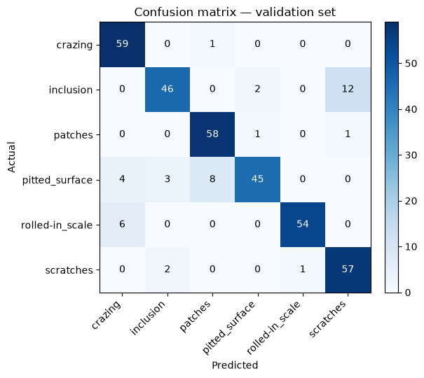
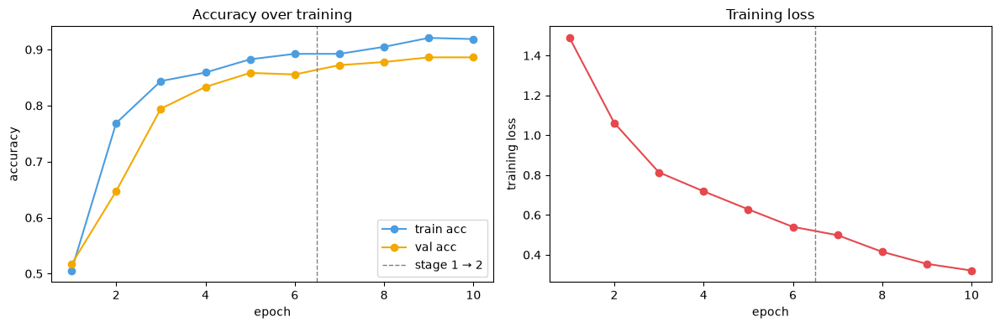

# QC Vision — Manufacturing Defect Classification with Transfer Learning

A CNN-based visual quality inspection system for manufacturing lines, built around a
transfer-learned ResNet-18 classifier and demonstrated end-to-end on the real
[NEU Surface Defect dataset](#dataset). Includes a trained model, an executed
Jupyter notebook with real results, a written report, and a reference implementation
of the wider production pipeline (severity scoring, automatic rejection, analytics
dashboard).


---

## Results at a glance

| Metric | Value |
|---|---|
| Model | ResNet-18 (ImageNet-pretrained, fine-tuned) |
| Dataset | NEU Surface Defect (1,800 images, 6 classes) |
| Validation accuracy | **88.6%** (319/360) |
| Best class (F1) | rolled-in_scale — 0.94 |
| Weakest classes (F1) | inclusion, pitted_surface — 0.83 |
| Training time | ~5 minutes, CPU-only |

<p align="center">
  
  
</p>

---

## Contents

- [What's included](#whats-included)
- [Dataset](#dataset)
- [Project structure](#project-structure)
- [Quickstart](#quickstart)
- [Usage](#usage)
- [Results](#results)
- [Architecture notes](#architecture-notes)
- [Limitations](#limitations)
- [Roadmap](#roadmap)
- [License & citation](#license--citation)

---

## What's included

This repo has two layers:

1. **A real, trained ML model** — a ResNet-18 classifier fine-tuned via two-stage
   transfer learning on real defect images, with genuine evaluation metrics, an
   executed notebook, and a written report. This is the part with actual results.
2. **A reference production pipeline** — code showing how a classifier like this
   would plug into a real inspection line: severity scoring, a pass/reject/
   human-review decision layer, hooks for PLC/GPIO-driven rejection hardware, an
   analytics database, and a dashboard. This part uses synthetic demo data, since
   no real factory line images or hardware were available — it's meant as an
   architecture reference, not a finished deployment.

## Dataset

Trained on the **NEU Surface Defect Database** (Song & Yan, 2013) — 1,800 grayscale
200×200 images, 300 per class, across six hot-rolled steel surface defect types:
`crazing`, `inclusion`, `patches`, `pitted_surface`, `rolled-in_scale`, `scratches`.

Images were sourced from this GitHub mirror (the original institutional host is
frequently unreliable):
[benlalaraid/NEU-Surface-Defect-Classification](https://github.com/benlalaraid/NEU-Surface-Defect-Classification)
— also mirrored on [Kaggle](https://www.kaggle.com/datasets/kaustubhdikshit/neu-surface-defect-database).

Images are grayscale by design, not by limitation: these defects are textural/
geometric phenomena, and real steel-line inspection cameras are overwhelmingly
monochrome for exactly that reason (see `report/Defect_Classification_Report.docx`,
§2.2, for the full justification).

## Project structure

```
qc_vision_system/
├── data/neu/                      NEU dataset (train/ and val/, per-class folders)
├── notebooks/
│   ├── defect_classification_report.ipynb   executed notebook — real results
│   ├── defect_classification_report.html    same, pre-rendered for quick viewing
│   ├── build_notebook.py                    regenerates the notebook structure
│   └── report_figures/                      exported plots (confusion matrix, etc.)
├── report/
│   └── Defect_Classification_Report.docx    written report for submission/review
├── outputs/
│   ├── neu_defect_model.pt                  trained model checkpoint
│   ├── final_metrics.json                   accuracy / precision / recall / F1
│   └── training_history.json                per-epoch training log
├── src/
│   ├── train_neu.py                         standalone training script (real data)
│   ├── model.py                             multi-task CNN (class + severity + bbox)
│   ├── dataset.py, train.py                 dataset loader / trainer for custom data
│   ├── severity.py                          severity scoring & reject-decision logic
│   ├── reject_actuator.py                   PLC/GPIO/simulated rejection hardware
│   ├── database.py                          SQLite inspection event logging
│   ├── inference_pipeline.py                live camera → decision → actuator loop
│   └── generate_demo_data.py, aggregate_for_dashboard.py
├── dashboard/
│   └── dashboard.html                       analytics dashboard (demo data)
├── requirements.txt
└── README.md
```

## Quickstart

```bash
git clone <your-repo-url>
cd qc_vision_system

python3 -m venv venv
source venv/bin/activate          # Windows: venv\Scripts\activate

pip install -r requirements.txt
pip install jupyter nbformat nbconvert
```

## Usage

### Just view the results (no setup needed)
Open `notebooks/defect_classification_report.html` in any browser, or
`report/Defect_Classification_Report.docx` in Word — both already contain the full
executed results.

### Re-run the training notebook
```bash
cd notebooks
jupyter nbconvert --to notebook --execute --inplace defect_classification_report.ipynb
```
Takes about 5 minutes on CPU; no GPU required.

### Run training as a plain script instead
```bash
python src/train_neu.py
```

### View the demo analytics dashboard
```bash
open dashboard/dashboard.html      # or double-click it
```

> **Note on pretrained weights:** this project loads ImageNet-pretrained ResNet-18
> weights via [`timm`](https://github.com/huggingface/pytorch-image-models), which
> hosts them as a GitHub release asset. This was a deliberate choice to stay
> reachable on restricted/sandboxed networks where `torchvision`'s default host
> (`download.pytorch.org`) is blocked — on a normal network, either approach works.

## Results

Full breakdown, figures, and discussion are in
`report/Defect_Classification_Report.docx` and the executed notebook. Summary:

- **Training**: two-stage transfer learning — 6 epochs with the backbone frozen
  (head warm-up), then 4 epochs fine-tuning the last residual block at a 10x lower
  learning rate.
- **Per-class F1**: crazing 0.91, inclusion 0.83, patches 0.91, pitted_surface 0.83,
  rolled-in_scale 0.94, scratches 0.88.
- **Main error mode**: `inclusion` most often confused with `scratches` (12/60) —
  both present as elongated dark linear features at low resolution. See the
  confusion matrix above.

## Architecture notes

- **Backbone**: ResNet-18, chosen over deeper nets (ResNet-50, EfficientNet-B0) as a
  capacity/speed balance appropriate for a ~1,800-image dataset and line-speed
  inference requirements.
- **Two-stage fine-tuning**: freeze-then-fine-tune, standard practice for small
  target datasets — protects pretrained features from noisy early gradients.
- **Augmentation**: horizontal + vertical flip, ±10° rotation. No color jitter —
  brightness/contrast *is* the defect signal in grayscale surface images, so
  jittering it risks washing out the thing being classified.
- **Full system model** (`src/model.py`) extends this with a severity-regression
  head and optional bounding-box head, for use once severity-labeled data is
  available — not used in the NEU experiment, which is classification-only.

## Limitations

- Trained at 96×96 resolution, CPU-only, for a ~5-minute reproducible run; higher
  resolution + GPU + longer schedule would likely close the gap to published
  mid-to-high-90s results on this benchmark.
- NEU is a clean, single-institution benchmark — a model trained here needs
  retraining/fine-tuning on real line images before any production use.
- No severity or bounding-box ground truth in this dataset, so the full multi-task
  model (`src/model.py`) is untrained here — classification only.
- The production-pipeline code (dashboard, actuators, database) runs on synthetic
  demo data and is an architecture reference, not a deployed system.

## Roadmap

- [ ] Train at native 200×200 / 224×224 resolution with GPU acceleration
- [ ] Collect severity-labeled data and train the multi-task model's severity head
- [ ] Swap SQLite for Postgres/TimescaleDB for multi-line deployments
- [ ] Add bounding-box annotations for defect localization

## License & citation

Code in this repository: MIT License.

Dataset citation:
> Song, K., & Yan, Y. (2013). A noise robust method based on completed local binary
> patterns for hot-rolled steel strip surface defects. *Applied Surface Science*, 285,
> 858–864.
